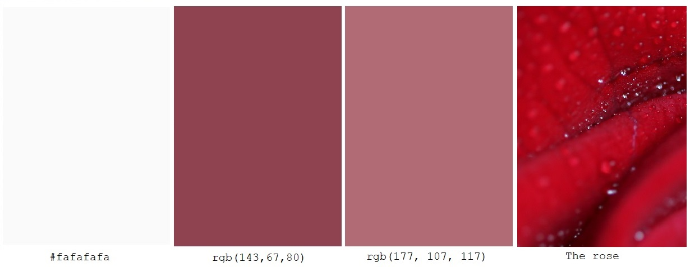

# Zuzu Valla Wedding Photography

## Welcome to "Zuzu Valla Wedding Photography" website.

#### To see the live website, please click on this [link](https://ondrejvalla.github.io/zuzu-valla/).

I would like to share with you this website, which I created as my First Milestone Project with Code Institute.
I created this website for my wife Zuzana Valla, who loves the photography. I think she is very talented. 
Zuzana's main focus is portrait photography, however, many people keep asking her if she could be their wedding photographer.  
Zuzana's current website only displays her art photography, therefore people can not see any wedding portraits. 
The aim of this project was to create a user-friendly website that could give my wife the ability to present herself as a wedding photographer. 
Easy to navigate website, where all potential customers can find out more about Zuzu's history and see a preview of previous weddings portraits, 
was the main focus. Users can also discover different wedding packages and prices Zuzana has to offer and are able to contact her directly by the contact form.  
I hope you will enjoy this website.

## Table of Contents
> - [Overview](#overview)
> - [User Experience](#user-experience)
> - [Features](#features)

## Overview  

We all know that couples planning their big wedding day have lots of preparation to do.
There is a lot of wedding photographers out there which they can choose from and lots of website to click through.
That is why I believe they like to see easy to orientate website, with useful information about the photographer 
and of course to see a portfolio of photographs and prices. And lastly, the ability to effectively contact the photographer to discuss any queries they may have. 

## User Experience  

- [User Stories](#user-stories)
- [The Scope Plane](#the-scope-plane)
- [The Structure Plane](#the-structure-plane)
- [Wireframes](#wireframes)
- [The Surface Plane](#the-surface-plane)

### User Stories

- User story 1: We would like to be able to easily navigate through Zuzu's website on the laptop and on our mobile phones.
- User story 2: As we are considering Zuzu to be our wedding photographer we would like to see her portfolio of previous weddings.
- User story 3: As we are currently in the stage of creating our wedding budget, 
                we would like to know how much does Zuzu Valla charge and what are we going to get for our money.
- User story 4: We would like to find out more about Zuzu.
- User story 5: We would like to contact Zuzu through this website.
- User story 6: We would like to see Zuzu's social media profiles. 

### The Scope Plane

In order to be able to decide who is going to be a couple's wedding photographer,
users must be able to find out the portfolio of previous work to see the photography style,
different packaging options, what does each package include and how much each package costs and 
who is the photographer capturing all them moments of their wedding day.

### The Structure Plane

This website consists of eight pages separated into four main sections:
- Home page contains an animated hero-image of a kissing couple, creating a"Love is in the air" atmosphere. Navbars in the Header and in the Footer to be able to continue further in to website. 
- Gallery page has two sections of: 
  1. Four wedding galleries links which takes users to individual wedding gallery page.
  2. The package/price list section on the bottom of the page.
- About page with profile picture and personal profile text.
- Contact page 

Each page has the navbar in the header and navbar in the footer for easy navigation through the website. 

### Wireframes 

As this was my first time creating wireframes I was not definitely decided about each detail of this website. 
However, I believe the main structure of the page has remained.
I did not implement a carousel on the home page, instead, I used an animated hero image of newlyweds. 
I found carousels more useful in each one of four individual gallery pages.
I have also added a price list at the bottom of the gallery page.

- Landing Page: <a href="assets/wireframes/landing-page.pdf" target="_blank">Home</a>

- Gallery Page: <a href="assets/wireframes/gallery-page.pdf" target="_blank">Gallery</a>

- About Page: <a href="assets/wireframes/about-page.pdf" target="_blank">About</a>

- Contact Page: <a href="assets/wireframes/contact-page.pdf" target="_blank">Contact</a>

### The Surface Plane

I was aiming to achieve a wedding mood touch of this website and also
to make it more personal by using my wife's favourite colours which are pink and red.  

- #### Images 
    All images used on this website were taken by my wife Zuzan Valla or myself Ondrej Valla. 
    Zuzana did the selection of photographs for me to use.

- #### Colours
    - I was aiming to use a colour theme to match the wedding atmosphere. 
    - The main and most dominant colour is colour of Header and Footer which is a darker shade of red, rgb(143,67,80)
    - The secondary dominant colour is a slightly pink colour which is used on most of the page's background, rgb(177, 107, 117)
    - The third most used colour is Gray98 color, #fafafafa
    - And lastly, my favourite is the beautiful red colour of the rose image which is used as a background on each individual wedding gallery page. 

- #### Icons
    - I used site Font Awesome to create Logo icons in Header and Footer.

## Features

