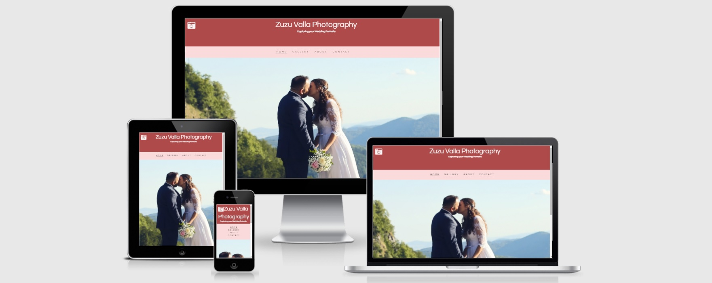

# Zuzu Valla Wedding Photography

## Welcome to "Zuzu Valla Wedding Photography" website.

#### To see the live website, please click on this [link](https://ondrejvalla.github.io/zuzu-valla/).

I would like to share with you this website, which I created as my First Milestone Project with Code Institute.
I created this website for my wife Zuzana Valla, who loves her photography. I think she is very talented. 
Zuzana's main focus is portrait photography, however, many people keep asking her if she could be their wedding photographer.  
Zuzana's current website only displays her art photography, therefore people can not see any wedding portraits. 
The aim of this project was to create a user-friendly website that could give my wife the ability to present herself as a wedding photographer. 
Easy to orientate website, where all potential customers can find out more about Zuzu's history and see a preview of previous weddings portraits. 
Also to clearly display different wedding packages and prices Zuzana has to offer and to be able to contact her directly by the contact form. 
I hope you will enjoy this website.

## Table of Contents
> - [Overview](#overview)
> - [User Experience](#user-experience)
> - [Overview](#overview)

## Overview  

We all know that excited couple planning their big wedding day have lots of preparation to do.
There is a lot of wedding photographers out there which they can choose from and lots of website to click through.
That is why I believe they like to see easy to orientate website, with useful information about the photographer 
and of course to see actual photographs and prices. And lastly, the ability to effectively contact the photographer to discuss any queries they may have. 

## User Experience  

> - [User Stories](#user-stories)
> - [The Scope Plane](#the-scope-plane)
> - [The Structure Plane](#the-structure-plane)
> - [Wireframes](#wireframes)
> - [The Surface Plane](#the-surface-plane)

### User Stories

- User story 1: We would like to be able to easily navigate through Zuzu's website on the laptop and also on our mobile phones.
- User story 2: As we are considering Zuzu to be our wedding photographer we would like to see her portfolio of previous weddings.
- User story 3: As we are currently in the stage of creating our wedding budget, 
                we would like to know how much does Zuzu Valla charge and what are we going to get for our money.
- User story 4: We would like to find out more about Zuzu.
- User story 5: We would like to contact Zuzu through this website.
- User story 6: We would like to see Zuzu's social media profiles. 

### The Scope Plane

