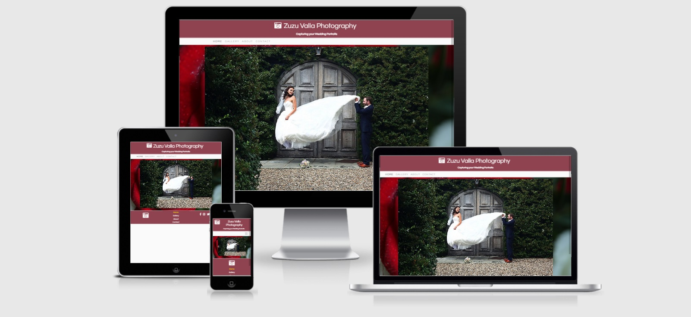
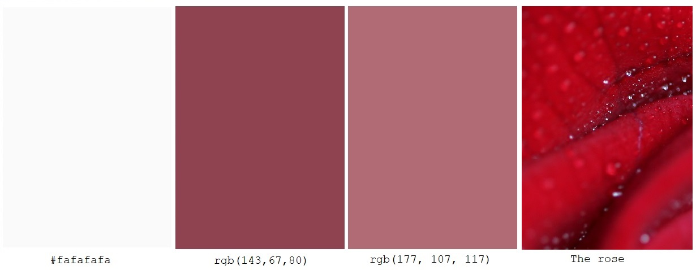
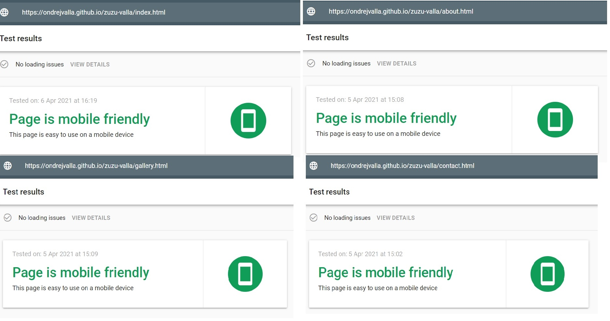
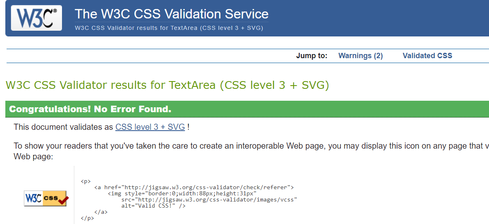

# Zuzu Valla Wedding Photography

## Welcome to Zuzu Valla Wedding Photography website.

#### To see the live website, please click on this [link](https://ondrejvalla.github.io/zuzu-valla/).

I would like to share with you this website, which I created as my First Milestone Project with Code Institute.
I created this website for my wife Zuzana Valla, who loves the photography. I think she is very talented. 
Zuzana's main focus is portrait photography, however, many people keep asking her if she could be their wedding photographer.  
Zuzana's current website only displays her art photography, therefore people can not see any wedding portraits. 
The aim of this project was to create a user-friendly website that could give my wife the ability to present herself as a wedding photographer. 
I focused to design easy to navigate website, where all potential customers can find out more about Zuzu, see her previous work and be able to get in touch.  
I hope you will enjoy this website.

## Table of Contents
> - [Overview](#overview)
> - [User Experience](#user-experience)
> - [Features](#features)
> - [Technologies Used](#technologies-used)
> - [Testing](#testing)
> - [Deployment](#deployment)
> - [Credits](#credits)

## Overview 

We all know that couples planning their big wedding day have lots of preparation to do.
There is a lot of wedding photographers out there which they can choose from and lots of website to click through.
That is why I believe they like to see easy to orientate website, with useful information about the photographer 
and of course to see a portfolio of photographs and prices. And lastly, the ability to effectively contact the photographer to discuss any queries they may have. 

---

## User Experience

- [User Stories](#user-stories)
- [The Scope Plane](#the-scope-plane)
- [The Structure Plane](#the-structure-plane)
- [Wireframes](#wireframes)
- [The Surface Plane](#the-surface-plane)

### User Stories

- User story 1: We would like to be able to easily navigate through Zuzu's website on the laptop and on our mobile phones.
- User story 2: As we are considering Zuzu to be our wedding photographer we would like to see her portfolio of previous weddings.
- User story 3: As we are currently in the stage of creating our wedding budget, 
                we would like to know how much does Zuzu Valla charge and what are we going to get for our money.
- User story 4: We would like to contact Zuzu through this website.
- User story 5: We would like to see Zuzu's social media profiles.
- User story 6: My friend has sent me the link to this website. I am asking myself "Who is Zuzu Valla?"

### The Scope Plane

In order to be able to decide who is going to be a couple's wedding photographer,
users must be able to find out the portfolio of previous work to see the photography style,
different packaging options, what does each package include and how much each package costs and 
who is the photographer capturing all them moments of their wedding day.

### The Structure Plane

This website consists of eight pages separated into four main sections:
- Home page contains a carousel slideshow, creating a"Love is in the air" atmosphere. 
  Navbars in the Header and in the Footer to be able to continue further in to website. 
- Gallery page has two sections of: 
  1. Four wedding galleries links which takes users to individual wedding gallery page.
  2. The package/price list section on the bottom of the page.
- About page with profile picture and personal profile text.
- Contact page with the photo of Zuzu Valla, Contact form and Package selection form, submit and reset buttons.

Each page has the navbar in the header and navbar in the footer for easy navigation through the website. 

### Wireframes 

As this was my first time creating wireframes I was not definitely decided about each detail of this website. 
However, I believe the main structure of the page has remained.
I did implement a carousel on the home page. 
I also found carousels very useful in each one of four individual gallery pages.
I have also added a price list at the bottom of the gallery page.

- Landing Page: <a href="assets/wireframes/landing-page.pdf" target="_blank">Home</a>

- Gallery Page: <a href="assets/wireframes/gallery-page.pdf" target="_blank">Gallery</a>

- About Page: <a href="assets/wireframes/about-page.pdf" target="_blank">About</a>

- Contact Page: <a href="assets/wireframes/contact-page.pdf" target="_blank">Contact</a>

### The Surface Plane

I was aiming to achieve a wedding mood touch of this website and also
to make it more personal by using my wife's favourite colours which are pink and red.  

- #### Images 
    All images used on this website were taken by my wife Zuzan Valla or myself Ondrej Valla. 
    Zuzana did the selection of photographs for me to use.

- #### Colours
    - I was aiming to use a colour theme to match the wedding atmosphere. 
    - The main and most dominant colour is colour of Header and Footer which is a darker shade of red, rgb(143,67,80)
    - The secondary dominant colour is a slightly pink colour which is used on most of the page's background, rgb(177, 107, 117)
    - The third most used colour is Gray98 color, #fafafafa
    - And lastly, my favourite is the beautiful red colour of the rose image which is used as a background on each individual wedding gallery page. 

- #### Icons
    - I used site Font Awesome to create Logo icons in Header and Footer.

---

## Features

- #### Navigation bar + Navigation Menu
    - By placing Navbar in the Header and small Navigation menu to the Footer, I wanted users to be able easily navigate through the website
      from every page.
    - On a mobile or tablet, the navbar is collapsed to the hamburger icon which expands when clicked to display the other pages.
    - Users can click on the logo or navbar brand to take the user back to the home-page.

- #### Home page
    - Contains an carousel slide show creating the wedding atmospere.
    - Users continue from home-page furter inside of the page through top navigation bar or the bottom menu section. 

- #### Gallery page
    This page contains two main sections:
- Gallery-menu 
    - Contains four cards of four weddings. Each card has names of bride and groom and a front image which behaves like a button to enter the particular wedding after being clicked.

- Price-list
    - Users can read through the packaging section and find out what each package does include and how much it cost.
    - Underneath the Package window is the "More info" button, which once clicked, takes users directly to the contact page. 

- #### About page
    - Contains a profile image of Zuzu Valla and Bio, a little story about Zuzu's past. Users can find out a little bit more about her.

- #### Contact page
    - The contact page has another image of Zuzu plus the heading text informing users to feel free to get in touch.
    - Contact form of Name, Surename, Email, Phone number and the Text area.
    - Underneath is the section for users to choose the packaging they liked, by ticking the relevant tick-box.
    - Further below is the green Submit form button and underneath is the Reset form button.

- #### Wedding galleries pages 
    - In total, there are four individual wedding galleries pages.
    - Each of these pages consists of a heading text with the name of the Bride and Groom, 
      six wedding images in two rows plus a little story about that particular photoshoot.
      Underneath is the slideshow carousel with large size images.  

- #### Footer
    - The footer contains a small navigation menu, Logo and relevant useful social media links available on each page.

## Features left to implement

- #### Improvements

    - Functionality of forms submit, to get forms directly to Zuzu's e-mail.
    - More wedding galleries, with even more photographs of the wedding day, from start to finish.
    - Booking form 

---

## Technologies Used

- #### Languages:
- [HTML](https://en.wikipedia.org/wiki/HTML)
- [CSS](https://en.wikipedia.org/wiki/CSS)

- #### Libraries:
- [Balsamiq](https://balsamiq.com/) for the wireframes of this readme.md file
- [Bootstrap 4.2.1](https://getbootstrap.com/) to use the grid system, pre-formatted features like buttons, collapsible navbar etc. across this website.
- [FontAwesome](https://fontawesome.com/) for icons
- [Google Fonts](https://fonts.google.com/) for fonts "Questrial"
- [JavaScript](https://code.jquery.com/) for collapsible navbar

#### Version Control:
- [Github](https://github.com/) - Used to store the code and use of Github Pages to deploy the website. 
- [Gitpod](https://gitpod.io/) - Used as the primary software for development and to push and commit code to Gihub.

#### Other:
- [Code Institute Course Content](https://courses.codeinstitute.net/) - Primary source of learning knowledge.
- [ChromeDevTools](https://developers.google.com/web/tools/chrome-devtools) - Used frequently to detect any bugs or layout differences.
- [W3Schools](https://www.w3schools.com/) - used as a general resource for HTML and CSS coding tips.
- [AmIResponsive](http://ami.responsivedesign.is/) - Used to check how the layout of the website looks across different devices. 
- [Google Mobile Friendly Test](https://search.google.com/test/mobile-friendly) - Used to test all pages on a mobile deviceA
- [Google](https://www.google.co.uk/) - Used for lots of general research.

---

## Testing

Usability was tested on the following browsers:

- Google Chrome (64 bit)
- Firefox (64-bit)
- Microsoft Edge (64bit)

I ensured the website is mobile friendly through [Google Mobile Friendly Test](https://search.google.com/test/mobile-friendly?utm_source=gws&utm_medium=onebox&utm_campaign=suit)

 

Tested on following mobiles:

- iPhone 6, 8, 12Pro
- Huawei P9, P10
- Samsung Galaxy S8, S9
- Sony Xperia Z3, L4, XA2

Tested on following tablets:

- Samsung Galaxy Tab A7
- iPad 2, iPad iPad 8th generation

#### Testing HTML and CSS
I used the following validators to check my HTML and CSS code:

[HTML Validator](https://validator.w3.org/)

All tested pages had shown No errors or warnings to show.

- [Home Page](https://validator.w3.org/nu/?doc=https%3A%2F%2Fondrejvalla.github.io%2Fzuzu-valla%2Findex.html)
- [Gallery Page](https://validator.w3.org/nu/?doc=https%3A%2F%2Fondrejvalla.github.io%2Fzuzu-valla%2Fgallery.html)
- [About Page](https://validator.w3.org/nu/?doc=https%3A%2F%2Fondrejvalla.github.io%2Fzuzu-valla%2Fabout.html)
- [Contact Page](https://validator.w3.org/nu/?doc=https%3A%2F%2Fondrejvalla.github.io%2Fzuzu-valla%2Fcontact.html)
- [Charlotte and Dan Page](https://validator.w3.org/nu/?doc=https%3A%2F%2Fondrejvalla.github.io%2Fzuzu-valla%2Fcharlotte-dan-wedding.html)

[CSS Validator](https://jigsaw.w3.org/css-validator/)

#### Testing forms

- To make sure the Forms was functioning as it should, I tested each of the forms on different devices and browsers. 
  This was done by clicking the Submit form button without any text in inputs to make sure it resulted with the desired response of 'Please fill out this field'.
  Once correctly filled, being send to The Code Institute Form validator.

#### Testing links
- Internal links have been checked so when clicked the user is directed to the desired location.
- External links have been checked to open in new tab and at correct destination.

#### Testing Users Stories

- 1. User Story:
  "We would like to be able to easily navigate through Zuzu's website on the laptop and on our mobile phones."
    
     - As the user enters the site, Top navigation bar is straigt away visible. Also after scrolling down, User will find Navigation in the Footer.
       After clicking the logo in the header and footer, home page does open.

- 2. User Story:
    "As we are considering Zuzu to be our wedding photographer we would like to see her portfolio of previous weddings"
    
     - There is lots of photographs from previous weddings. Home page has carousel of previous weddings slide show.
       The Gallery page offers four Wedding albums with a little story each.

- 3. User Story:
    "As we are currently in the stage of creating our wedding budget, we would like to know how much does Zuzu Valla charge and what are we going to get for our money."

     - For all users interested in the price, website has Price list section right under the gallery menu. 
       Users can find out what each package include. They will know what they going to get for their money.

- 4. User Story: 
    "We would like to contact Zuzu through this website."

     - Contact page includes a contact form and multiple enquiry buttons for users interested in particular Wedding Package option.

- 5. User Story:
    "We would like to see Zuzu's social media profiles."

     - For further exploration of Zuzu Valla photography, users can visit Zuzu's social media profiles. 
       All relevant links are on the bottom of the page in the footer section. Every link is opening in separate tab, for easy return to the website.

- 6. User Story:
    "My friend has sent me the link to this website. I am asking myself "Who is Zuzu Valla?" "
    
     - Users who do not know Zuzu Valla, can find out more through this website. About section uncovers a bio story about Zuzu. 
       Galleries in this page shows the photography style Zuzu has. Also, very helpful are the social media links which takes users for further exploration.   

---

## Bugs

- At the beginning of this project I was not using a bootstrap grid (with container > row > column). This caused a horizontal overflow and an un-organized appearance.
  Once started to use the bootstrap grid (container-fluid) class, the issues were improved.

- The first time generating of the project Bootstrap link I found out that lots of images were not displaying. 
  This was simple, but a very helpful learning curve. My file paths were incorrect. /assets/images...jpg instead of no slash assets/images...jpg 

- The original front-page hero image was unresponsive on small screens and mobile devices. 
  After several unsuccessful attempts of wrapping the image into Bootstrap grid, I found out that the actual image size is too wide and low,
  unable to fit the mobile screen size. 
  I completely removed this particular Hero image and applied a Carousel. 
  This Carousel has improved the responsiveness of the front page and also improved the appearance of the page.

- My first menu page was not collapsing into the burger menu. All that was happening was only the resizing of the menu.
  This was not up to visual and technical standard expectation, that is why I have decided to use Bootstrap Navbar.
  The responsiveness has improved massively and on the medium and small screens, the Burger menu appears.   

- The current Burger menu was not appearing on the right. I was always in the middle. 
  I created a new class for the element and by using position relative I was able to direct the menu where I wanted it.

---

## Deployment

[Link to deployed website](https://ondrejvalla.github.io/zuzu-valla/index.html)

To deploy to GitHub Pages from GitHub repository, the following steps must be followed:

1. Log into GitHub
2. From the list of repositories on the screen, select **OndrejValla/zuzu-valla**
3. From the menu items near the top of the page, select **Settings**
4. Scroll down to the **GitHub Pages** section
5. Under **Source** click the drop-down menu labelled **None** and select **main**
6. In the **folder** drop-down, the **/root** folder is automatically selected
7. Click on **Save**
8. The project is now deployed and the URL of the website is available in the GitHub Pages section

### How to run this project locally

To clone this project into Gitpod you will need:

1. A Github account
2. Use the Chrome browser

Then follow these steps:

1. Install the Gitpod Browser Extension for Chrome
2. After installation, restart the browser
3. Log into Gitpod with your gitpod account
4. Navigate to the Project GitHub repository
5. Click the green GitPod button in the top right corner of the repository
6. This will trigger a new gitpod workspace to be created

To work on the project code:

1. Follow this link to the [GitHub repository](https://github.com/OndrejValla/zuzu-valla)
2. Click on the Code button
3. In the drop-down, copy the URL that you see in the HTTPs tab
4. In your local IDE, open the terminal
5. Change the current working directory to the location where you want the cloned directory to be made
6. Type git clone and paste the URL you copied in Step 3
7. Press Enter. Your local clone will be created.
  
   That is all.

## Credits

### Media
- All photographs used in this project were provided by my wife Zuzana Valla a.k.a. Zuzu Valla.

### Acknowledgements

- My BIGGEST Thanks goes to my lovely wife, for all her support and understanding.
- I was inspired by Zuzu Valla, as she told me, that she would like to have a separate website for her Wedding photography.
- My Mentor, **Nishant Kumar**, for his honest feedbacks.
- Tutor Support, Kevin Loughrey and Sheryl Goldberg for their support, anytime of the day or night.
- Thank you to Anna Greaves for creating [this helpful webinar](https://www.youtube.com/watch?v=7BteidgLAyM).
- The Code Institute for creating this amazing course and for the oportunity to learn how to code.